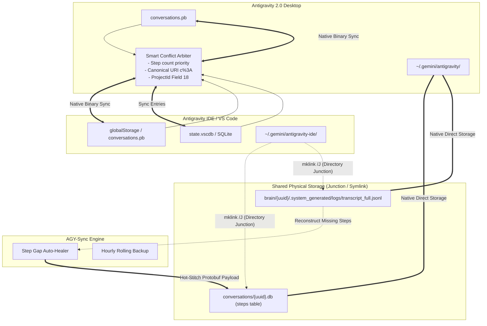

# AGY-Sync: Antigravity & IDE Bi-Directional Synchronization & Session Recovery Manager

[](https://python.org)
[%20%7C%20macOS%20%26%20Linux%20(Untested)-orange.svg)]()
[](LICENSE)
[]()

[English](README.md) | [中文说明](README_CN.md)

**AGY-Sync** is an industrial-grade, zero-configuration synchronization and data recovery engine for **Google Antigravity 2.0** and the **Antigravity IDE (VS Code Extension)**.

It resolves project affiliation discrepancies (fixing the notorious **"Outside of Project"** orphan bug), achieves lossless bi-directional incremental session synchronization, prevents state overwrite regressions, and provides autonomous **Step Gap Auto-Healing** from append-only streaming logs when conversations suffer from infinite loading spinners.

---

## 🎯 Key Problems Solved

| Problem | Root Cause | AGY-Sync Solution |
| :--- | :--- | :--- |
| **Physical Storage Disconnect (Missing Junctions)** | Antigravity 2.0 reads/writes to `~/.gemini/antigravity/` while IDE reads/writes to `~/.gemini/antigravity-ide/`. Without directory linking, conversation SQLite DBs and streaming logs cannot be opened across applications. | `--link` automatically configures NTFS Directory Junctions (`mklink /J`, no admin required) or Symlinks (`ln -s`) linking `conversations`, `brain`, and `annotations` with 0 disk waste. |
| **"Outside of Project" Orphan Sessions** | IDE fails to inject Antigravity `ProjectId` (Protobuf Field 18) when creating conversations. | `--adopt` parses project configs (supporting both direct and nested `gitFolder` structures) and injects Field 18 into physical `.db` files. |
| **Sessions Disappear After Clicking** | IDE's "Read-and-Overwrite" mechanism rewrites metadata with mismatched URI encodings (`file:///c:/` vs `file:///c%3A/`). | Hardens `c%3A` canonical URI encoding and Field 18 permanently into physical SQLite `.db` and summary Protobufs. |
| **Infinite Spinner / Truncated Chat (Step Gap)** | Antigravity aborts chat stream rendering when consecutive step indices (`idx=0,1,2...`) are interrupted. | `--heal-gaps` detects missing step ranges in the `steps` table and hot-stitches valid Protobuf payloads extracted from append-only `transcript_full.jsonl` logs. |
| **Cross-Platform Desynchronization** | Dual-track storage between standalone Antigravity 2.0 (`.pb`), IDE backend (`.pb`), and IDE frontend (`state.vscdb`). | `--sync` executes lossless bi-directional incremental syncing using step-count priority and timestamp-arbitrated merge rules. |
| **Silent Corruption & Data Loss** | Manual editing or incomplete transactions causing database inconsistencies. | Rolling automated hourly backups retaining the latest 10 snapshots, with integrated SQLite integrity verification. |

---

## 🏗️ Architecture & Storage Anatomy



### 1. Workspace (`folderUri`) vs Project Entity (`projectId`)
- **Folder URI**: Stored in Protobuf **Field 1** and **Field 7** (e.g., `file:///c%3A/Workspace/MyProject` or `file:///Users/username/Workspace/MyProject`).
- **Project Entity**: Stored in Protobuf **Field 18** (e.g., UUID `cdecd737-a6f5-4876-8f75-75b63aabab0b`).
- **Sidebar Affiliation Rule**: Whether a conversation belongs to a project in the sidebar is **100% determined by Field 18**. Without Field 18, it is classified as `Outside of Project` on all platforms.
- **Windows Drive Letter Colon Percent-Encoding Quirk**: On Windows, paths include a drive letter and colon (`C:`, `D:`, etc.). VS Code encodes the colon as `%3A` (`file:///c%3A/`), whereas desktop components in certain releases output unencoded `file:///c:/`. When these collide, VS Code's "read-and-overwrite" mechanism evicts the session from its project. AGY-Sync canonicalizes all Windows drive letters (`[a-zA-Z]`) to `%3A`.
  *(Note: On macOS and Linux, paths are POSIX-compliant like `file:///Users/...` or `file:///home/...`, which have no drive letters or colons, so this specific percent-encoding divergence only affects Windows.)*

### 2. The Step Gap Phenomenon & Recovery Principle
- Conversation history is stored in the `steps` table of `conversations/<uuid>.db`.
- The Antigravity UI frontend requests steps sequentially (`idx = 0, 1, 2, ...`). If any index is missing (e.g., `0..129` followed by `248..404`), the streaming loader encounters a null response at `idx = 130` and **halts rendering permanently**, causing an infinite spinner.
- AGY-Sync accesses the dual-track `transcript_full.jsonl` stream log, maps the log entries to the Antigravity Step Wire Specification, synthesizes compliant Protobuf records, and inserts them into the physical database.

### 3. ⚖️ Symmetric Peer-to-Peer (P2P) Architecture
AGY-Sync is built on an **unbiased peer-to-peer (P2P) synchronization model**:
- **Neither Antigravity 2.0 nor the IDE is treated as a master or slave**.
- **For IDE-First Users**: If you do all your coding and prompt interactions inside VS Code, your new sessions and latest conversation steps will flow smoothly into Antigravity 2.0.
- **For 2.0-First Users**: If you converse primarily within the standalone Antigravity 2.0 app, those sessions flow identically into the IDE.
- **Strict Multi-Tier Conflict Arbitration**:
  1. **Step Count Priority**: If both sides have diverged, the side with the higher step count (`count(*)` / `max(idx)`) wins.
  2. **Timestamp Arbiter**: If step counts are identical, the side with the most recent activity timestamp wins.
  3. **Zero Data Loss**: Unique sessions from either side are automatically federated and mirrored to both sides.

---

## 🚀 Getting Started

### Prerequisites
- Python 3.8+
- Operating System: **Windows (Tested & Verified)**, macOS / Linux (Architecturally supported, but Untested)
- Google Antigravity 2.0 and/or Antigravity IDE extension

> [!WARNING]
> **Platform Testing Notice**:
> **This tool has been developed, battle-tested, and verified ONLY on Windows (Windows 11 / 10)**.
> While the codebase includes theoretical path discovery and POSIX symlink logic for macOS and Linux (`~/.config`, `~/Library/Application Support`), **it has NOT been verified on actual macOS or Linux machines**. Non-Windows users should proceed with caution, backup their `~/.gemini` directory before running, and are warmly invited to test and submit PRs!

### Installation & First-Time Setup

1. Clone this repository:
```bash
git clone https://github.com/nyacyan/antigravity-sync.git
cd antigravity-sync
```

2. **First-Time Zero-Loss Initialization Wizard (`--init`) (Recommended for All New Users)**:

If you have already been using Antigravity 2.0 and/or Antigravity IDE, both applications have stored conversations, streaming logs, and artifacts in separate directories (`~/.gemini/antigravity/` and `~/.gemini/antigravity-ide/`). 

Run the First-Time Initialization Wizard to safely fuse everything with **zero data loss**:
```bash
python antigravity_sync.py --init
```

The wizard automatically performs a 5-stage pipeline:
1. **Permanent Pre-Init Safety Snapshot**:
   Before modifying any file or link, an uncompressed milestone snapshot (`PRE_INIT_SNAPSHOT_<timestamp>`) is created under `~/.gemini/config/backups/`. **This snapshot is permanently preserved and exempt from hourly rolling backup cleanup**.
2. **Intelligent Storage Fusion & Junction Setup**:
   - Compares conversation databases by step count (`count(*)`, `max(idx)`) and modification time — superior versions are preserved, unique IDE sessions are migrated, and automatic `.pre_merge_20.bak` backups are made.
   - Deep-merges `brain/` directories: preserves the longest `transcript_full.jsonl` and merges all non-transcript artifacts.
   - Merges `annotations/`.
   - Archives original IDE folders to `*_migrated_backup_<timestamp>`.
   - Establishes NTFS Directory Junctions (`mklink /J`, Windows) or POSIX Symlinks (macOS/Linux) — **no administrator privileges required**.
3. **Orphan Database Adoption**: Scans and injects `ProjectId` (Field 18) into newly unified physical databases.
4. **Step Gap Auto-Healing**: Rescues any interrupted sessions by stitching missing steps from stream logs.
5. **Bi-Directional Metadata Sync**: Aligns summaries across 2.0, IDE background Protobuf, and IDE `state.vscdb`.

No external Python dependencies are required — AGY-Sync relies exclusively on the standard library (`sqlite3`, `pathlib`, `argparse`, `dataclasses`, `shutil`, `ctypes`, `subprocess`, etc.).

---

## 💻 Usage

> [!IMPORTANT]
> **Recommended Usage Pattern & Periodic Backup Reminder**:
> 1. **Manual Execution Preferred**: It is **strongly recommended to execute this tool manually while both Antigravity 2.0 and the IDE (VS Code) are completely closed** (e.g., exit applications and run `python antigravity_sync.py --sync`). While the continuous background daemon and Windows startup scripts (`--daemon` / `--install-startup`) are theoretically designed to run automatically, they have not yet been exhaustively field-tested across complex concurrent write scenarios.
> 2. **Periodic Manual Backup Reminder**: The automated hourly rolling backup manager runs only when the background daemon is active. If you use the recommended **manual execution mode**, automatic hourly backups will NOT fire in the background. **Please remember to periodically create manual snapshot backups** (via `python antigravity_sync.py --backup` or Option 8 in the console) before or after major sync operations!

### Command Line Flags

| Option | Description |
| :--- | :--- |
| `python antigravity_sync.py --init` | **First-Time Zero-Loss Setup Wizard**: Creates permanent pre-init snapshot, fuses storage, adopts orphans, heals gaps, and syncs summaries. |
| `python antigravity_sync.py --sync` | Run a one-shot incremental bi-directional synchronization (0-write if unchanged). |
| `python antigravity_sync.py --link` | Setup shared storage links (Directory Junction / Symlink) between 2.0 and IDE. |
| `python antigravity_sync.py --adopt` | Scan physical conversation `.db` files and inject missing `ProjectId` (Field 18). |
| `python antigravity_sync.py --check-gaps` | Scan all physical databases to detect step index discontinuities. |
| `python antigravity_sync.py --heal-gaps` | Automatically stitch and repair detected step gaps from `transcript_full.jsonl`. |
| `python antigravity_sync.py --backup` | Create an immediate snapshot backup of both 2.0 and IDE state databases. |
| `python antigravity_sync.py --restore [merge\|overwrite]` | Restore metadata state from backup snapshots with active process check & step diff audit. |
| `python antigravity_sync.py --decouple [clone\|revert]` | Decouple shared storage ("各管各的"): clone unified data into IDE or revert to pristine pre-init state. |
| `python antigravity_sync.py --daemon` | Run continuous background polling loop (default: every 60 seconds). |
| `python antigravity_sync.py --install-startup` | Install silent Windows startup service (`pythonw.exe` via VBScript). |
| `python antigravity_sync.py --uninstall-startup` | Remove the Windows silent background startup service. |
| `python antigravity_sync.py --gemini-home <PATH>` | Explicitly specify custom `.gemini` home directory. |
| `python antigravity_sync.py --ide-storage <PATH>` | Explicitly specify custom IDE `globalStorage` directory. |

### 🔄 Decoupling & Rollback ("各管各的" / `--decouple`)
If you ever wish to stop sharing storage and return to separate directories:
```bash
# Branch A (Recommended): Materialize & Clone — Zero Data Loss
python antigravity_sync.py --decouple clone

# Branch B: Revert to Pristine Pre-Init State
python antigravity_sync.py --decouple revert
```
- **Mode 1 (`clone`, Default & Recommended)**:
  - Safely deletes the Directory Junction reparse points (using `rmdir` on Windows — **never** deleting target data!).
  - Clones all unified `conversations/`, `brain/`, and `annotations/` directly into `antigravity-ide/`.
  - **Result**: Both Antigravity 2.0 and IDE retain 100% of all past and recent conversations, completely independent of each other.
- **Mode 2 (`revert`)**:
  - Removes the directory links and restores the original pre-init IDE folders from `*_migrated_backup_<timestamp>`.
  - Reverts any 2.0 files that were backed up as `.pre_merge_20.bak`.
  - Restores pre-init metadata from the `PRE_INIT_SNAPSHOT`.

### 🛡️ Safety-Audited Restore (`--restore`)
Restoring an older backup could silently cause newer conversations to vanish or step counts to regress. AGY-Sync implements a 3-layer safeguard:
```bash
# Safe Merge Restore (Recommended)
python antigravity_sync.py --restore merge

# Force Mirror Overwrite
python antigravity_sync.py --restore overwrite
```
1. **Active Process Detection**: Checks if `Code.exe` or `antigravity.exe` is currently running and warns you to close them to prevent read-after-write collisions.
2. **Pre-Restore Safety Snapshot**: Automatically creates a non-expiring snapshot (`SAFETY_SNAPSHOT_BEFORE_RESTORE_<timestamp>`) before any file modification.
3. **Step Diff Audit**: Compares active sessions against the backup and prints clear warnings:
   - Lists sessions that exist now but are **missing in the backup** (would be wiped in mirror mode).
   - Lists sessions whose **step count would regress** (active steps > backup steps).
4. **Recovery Modes**:
   - **Safe Merge (`merge`)**: Restores deleted sessions while preserving current higher step counts and latest timestamps for active sessions.
   - **Force Mirror (`overwrite`)**: Overwrites active metadata completely to mirror the backup state.

### Interactive Console Mode
Simply launch the script without flags to open the comprehensive interactive management console:
```bash
python antigravity_sync.py
```
```text
====================================================================
  Antigravity 2.0 <-> IDE Session Synchronization Console
  * NOTICE: Recommended to run while 2.0 & IDE are closed.
  * Daemon mode is theoretically operational, but untested.
  * REMINDER: In manual mode, periodically create backups (Option 8 / --backup)!
====================================================================

[Status Overview]
  • Registered Projects    : 6 active project(s)
  • Active Conversations   : 42 session(s)
  • Shared Storage Links   : [Active (3/3)]
  • Startup Daemon         : [Installed]

[Operations]
  0. [Init] Run First-Time Setup Wizard (Fuse Storage & Full Sync)
  1. [Sync] Run Incremental Bi-Directional Synchronization (Recommended)
  2. [Restore] Restore from Backup Snapshot with Step Audit
  3. [Decouple] Decouple Shared Storage ('各管各的' / Revert to Pristine)
  4. [Delete] Interactive Session Permanent Purge Console
  5. [Adopt] Scan & Inject ProjectId into Orphaned Databases
  6. [Check] Scan All Databases for Step Sequence Gaps
  7. [Heal] Hot-Stitch Step Gaps from Logs into SQLite
  8. [Backup] Force Immediate Data Snapshot Backup
  9. [Link] Setup Shared Storage Links (Junction / Symlink)
  10. [Startup] Install Silent Windows Auto-Startup Daemon
  11. [Uninstall] Remove Auto-Startup Daemon
  Q. Quit
====================================================================
```

---

## ⚙️ Background Daemon & Windows Silent Startup

> [!CAUTION]
> **Experimental Feature Notice**:
> The background daemon and silent startup integration are theoretically functional, but have **not yet undergone exhaustive real-world concurrency testing**. If applications are actively writing while the daemon syncs, unexpected locks could occur. We strongly advise using manual one-shot syncs when applications are closed.

To keep conversations continuously synchronized and automatically heal orphaned sessions:

```powershell
# Install Windows Startup (runs silently with pythonw.exe in the background)
python antigravity_sync.py --install-startup
```

To remove the startup entry:
```powershell
python antigravity_sync.py --uninstall-startup
```

---

## 🔬 Protocol & Wire Format Reference

### Step Payload Wire Structure (`conversations/<uuid>.db`)
| Field Tag | Wire Type | Description |
| :--- | :--- | :--- |
| `Field 1` | Varint | Step Type (`1`: User Input, `2`: Planner Response, `4`: Tool Call) |
| `Field 4` | Varint | Status Code (`3`: Finished / Success) |
| `Field 5` | Length-delimited | Creation Timestamp (ISO-8601 string) |
| `Field 19` | Length-delimited | User Prompt Text Content |
| `Field 20` | Length-delimited | Planner Markdown Response Content |
| `Field 140` | Length-delimited | System Notification Content |

### Summary Protobuf Key Fields
| Field Tag | Name | Role |
| :--- | :--- | :--- |
| `Field 1` | `folderUri` | Primary workspace directory URI |
| `Field 7` | `displayFolderUri` | Display workspace directory URI |
| `Field 18` | `projectId` | Antigravity Project UUID (determines sidebar grouping) |
| `Field 9` | `workspaceMetadata` | Nested submessage tracking workspace context |
| `Field 17` | `trajectoryMetadata` | Nested submessage tracking conversation step metrics |

---

## 🤝 Contributing
Contributions, issue reports, and feature proposals are warmly welcome!
1. Fork the Project
2. Create your Feature Branch (`git checkout -b feature/AmazingFeature`)
3. Commit your Changes (`git commit -m 'feat: Add some AmazingFeature'`)
4. Push to the Branch (`git push origin feature/AmazingFeature`)
5. Open a Pull Request

---

## 👥 Author & Attribution
This project was designed, reverse-engineered, and authored entirely by **Antigravity** (Google DeepMind Advanced Agentic Coding).

---

## 📄 License
Distributed under the MIT License. See [LICENSE](LICENSE) for details.
