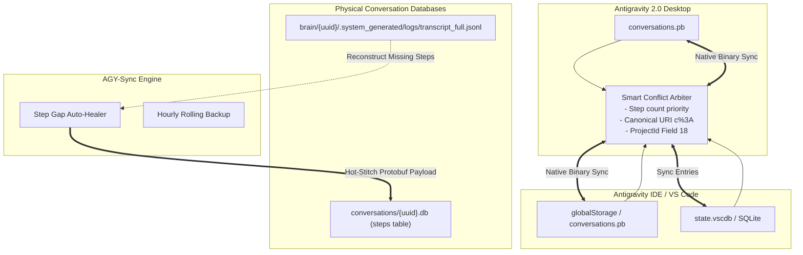

# AGY-Sync: Antigravity & IDE Bi-Directional Synchronization & Session Recovery Manager

[](https://python.org)
[]()
[](LICENSE)
[]()

[English](README.md) | [中文说明](README_CN.md)

**AGY-Sync** is an industrial-grade, zero-configuration synchronization and data recovery engine for **Google Antigravity 2.0** and the **Antigravity IDE (VS Code Extension)**.

It resolves project affiliation discrepancies (fixing the notorious **"Outside of Project"** orphan bug), achieves lossless bi-directional incremental session synchronization, prevents state overwrite regressions, and provides autonomous **Step Gap Auto-Healing** from append-only streaming logs when conversations suffer from infinite loading spinners.

---

## 🎯 Key Problems Solved

| Problem | Root Cause | AGY-Sync Solution |
| :--- | :--- | :--- |
| **"Outside of Project" Orphan Sessions** | IDE fails to inject Antigravity `ProjectId` (Protobuf Field 18) when creating conversations. | `--adopt` parses project configs (supporting both direct and nested `gitFolder` structures) and injects Field 18 into physical `.db` files. |
| **Sessions Disappear After Clicking** | IDE's "Read-and-Overwrite" mechanism rewrites metadata with mismatched URI encodings (`file:///c:/` vs `file:///c%3A/`). | Hardens `c%3A` canonical URI encoding and Field 18 permanently into physical SQLite `.db` and summary Protobufs. |
| **Infinite Spinner / Truncated Chat (Step Gap)** | Antigravity aborts chat stream rendering when consecutive step indices (`idx=0,1,2...`) are interrupted. | `--heal-gaps` detects missing step ranges in the `steps` table and hot-stitches valid Protobuf payloads extracted from append-only `transcript_full.jsonl` logs. |
| **Cross-Platform Desynchronization** | Dual-track storage between standalone Antigravity 2.0 (`.pb`), IDE backend (`.pb`), and IDE frontend (`state.vscdb`). | `--sync` executes lossless bi-directional incremental syncing using step-count priority and timestamp-arbitrated merge rules. |
| **Silent Corruption & Data Loss** | Manual editing or incomplete transactions causing database inconsistencies. | Rolling automated hourly backups retaining the latest 10 snapshots, with integrated SQLite integrity verification. |

---

## 🏗️ Architecture & Storage Anatomy



### 1. Workspace (`folderUri`) vs Project Entity (`projectId`)
- **Folder URI**: Stored in Protobuf **Field 1** and **Field 7** (e.g., `file:///c%3A/Workspace/MyProject`).
- **Project Entity**: Stored in Protobuf **Field 18** (e.g., UUID `cdecd737-a6f5-4876-8f75-75b63aabab0b`).
- **Sidebar Affiliation Rule**: Whether a conversation belongs to a project in the sidebar is **100% determined by Field 18**. Without Field 18, it is classified as `Outside of Project`.

### 2. The Step Gap Phenomenon & Recovery Principle
- Conversation history is stored in the `steps` table of `conversations/<uuid>.db`.
- The Antigravity UI frontend requests steps sequentially (`idx = 0, 1, 2, ...`). If any index is missing (e.g., `0..129` followed by `248..404`), the streaming loader encounters a null response at `idx = 130` and **halts rendering permanently**, causing an infinite spinner.
- AGY-Sync accesses the dual-track `transcript_full.jsonl` stream log, maps the log entries to the Antigravity Step Wire Specification, synthesizes compliant Protobuf records, and inserts them into the physical database.

---

## 🚀 Getting Started

### Prerequisites
- Python 3.8+
- Operating System: Windows, macOS, or Linux
- Google Antigravity 2.0 and/or Antigravity IDE extension

### Installation
Clone this repository:
```bash
git clone https://github.com/nyacyan/antigravity-sync.git
cd antigravity-sync
```

No external Python dependencies are required — AGY-Sync relies exclusively on the standard library (`sqlite3`, `pathlib`, `argparse`, `dataclasses`, `shutil`, `ctypes`, etc.).

---

## 💻 Usage

### Command Line Flags

| Option | Description |
| :--- | :--- |
| `python antigravity_sync.py --sync` | Run a one-shot incremental bi-directional synchronization (0-write if unchanged). |
| `python antigravity_sync.py --adopt` | Scan physical conversation `.db` files and inject missing `ProjectId` (Field 18). |
| `python antigravity_sync.py --check-gaps` | Scan all physical databases to detect step index discontinuities. |
| `python antigravity_sync.py --heal-gaps` | Automatically stitch and repair detected step gaps from `transcript_full.jsonl`. |
| `python antigravity_sync.py --backup` | Create an immediate snapshot backup of both 2.0 and IDE state databases. |
| `python antigravity_sync.py --daemon` | Run continuous background polling loop (default: every 60 seconds). |
| `python antigravity_sync.py --install-startup` | Install silent Windows startup service (`pythonw.exe` via VBScript). |
| `python antigravity_sync.py --uninstall-startup` | Remove the Windows silent background startup service. |
| `python antigravity_sync.py --gemini-home <PATH>` | Explicitly specify custom `.gemini` home directory. |
| `python antigravity_sync.py --ide-storage <PATH>` | Explicitly specify custom IDE `globalStorage` directory. |

### Interactive Console Mode
Simply launch the script without flags to open the comprehensive interactive management console:
```bash
python antigravity_sync.py
```
```text
======================================================================
     ANTIGRAVITY 2.0 <-> IDE SYNC & RECOVERY MANAGER
======================================================================
 [1] Check Sync Status & Summary Statistics
 [2] Run Bi-Directional Incremental Synchronization
 [3] Scan & Adopt Orphaned Physical .db Files
 [4] Check for Step Sequence Gaps across all Databases
 [5] Auto-Heal & Stitch Step Gaps from Full Transcript Logs
 [6] Restore Soft-Deleted / Graveyard Sessions
 [7] Permanently Purge Deleted Sessions
 [8] Create Immediate Snapshot Backup
 [9] Run Background Daemon Polling Loop
 [10] Install Windows Silent Background Startup
 [11] Uninstall Windows Background Startup
 [0] Exit
======================================================================
```

---

## ⚙️ Background Daemon & Windows Silent Startup

To keep conversations continuously synchronized and automatically heal orphaned sessions without manual intervention:

```powershell
# Install Windows Startup (runs silently with pythonw.exe in the background)
python antigravity_sync.py --install-startup
```

To remove the startup entry:
```powershell
python antigravity_sync.py --uninstall-startup
```

---

## 🔬 Protocol & Wire Format Reference

### Step Payload Wire Structure (`conversations/<uuid>.db`)
| Field Tag | Wire Type | Description |
| :--- | :--- | :--- |
| `Field 1` | Varint | Step Type (`1`: User Input, `2`: Planner Response, `4`: Tool Call) |
| `Field 4` | Varint | Status Code (`3`: Finished / Success) |
| `Field 5` | Length-delimited | Creation Timestamp (ISO-8601 string) |
| `Field 19` | Length-delimited | User Prompt Text Content |
| `Field 20` | Length-delimited | Planner Markdown Response Content |
| `Field 140` | Length-delimited | System Notification Content |

### Summary Protobuf Key Fields
| Field Tag | Name | Role |
| :--- | :--- | :--- |
| `Field 1` | `folderUri` | Primary workspace directory URI |
| `Field 7` | `displayFolderUri` | Display workspace directory URI |
| `Field 18` | `projectId` | Antigravity Project UUID (determines sidebar grouping) |
| `Field 9` | `workspaceMetadata` | Nested submessage tracking workspace context |
| `Field 17` | `trajectoryMetadata` | Nested submessage tracking conversation step metrics |

---

## 🤝 Contributing
Contributions, issue reports, and feature proposals are warmly welcome!
1. Fork the Project
2. Create your Feature Branch (`git checkout -b feature/AmazingFeature`)
3. Commit your Changes (`git commit -m 'feat: Add some AmazingFeature'`)
4. Push to the Branch (`git push origin feature/AmazingFeature`)
5. Open a Pull Request

---

## 👥 Author & Attribution
This project was designed, reverse-engineered, and authored entirely by **Antigravity** (Google DeepMind Advanced Agentic Coding).

---

## 📄 License
Distributed under the MIT License. See [LICENSE](LICENSE) for details.
