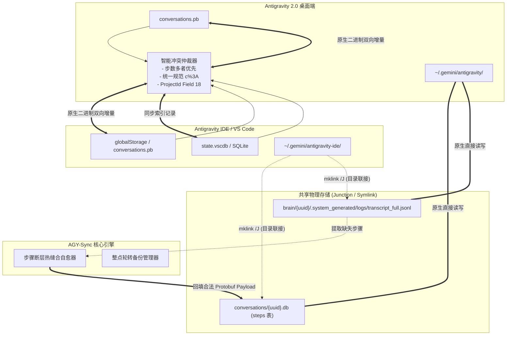

# AGY-Sync: Antigravity 2.0 与 IDE 双向智能同步与会话断层修复管理器

[](https://python.org)
[]()
[](LICENSE)
[]()

[English Documentation](README.md) | [中文说明](README_CN.md)

**AGY-Sync** 是专为 **Google Antigravity 2.0** 独立版与 **Antigravity IDE 插件 (VS Code 扩展体系)** 打造的工业级、零配置双向同步与会话数据恢复引擎。

彻底解决会话归属混乱（修复著名的 **"Outside of Project"** 孤儿会话问题）、实现无损增量双向同步、阻断 IDE 读后回写破坏、并在会话出现无限转圈或历史中断时，从流式日志中执行全自动 **会话步骤断层缝合（Step Gap Auto-Healing）**。

---

## 🎯 核心解决痛点

| 痛点场景 | 产生根因 | AGY-Sync 解决方案 |
| :--- | :--- | :--- |
| **物理存储层割裂（缺失 Junction 目录链接）** | 2.0 读写 `~/.gemini/antigravity/`，IDE 读写 `~/.gemini/antigravity-ide/`。若底层不打通，两端根本找不到彼此的物理 SQLite 库与日志。 | `--link` 自动建立 NTFS Directory Junction 软链接（`mklink /J`，无需管理员权限），使 `conversations`、`brain`、`annotations` 零冗余物理级完全共享。 |
| **会话沦为 "Outside of Project" 孤儿** | IDE 新建会话时只传递工作区目录，遗漏了 Protobuf 的 Field 18 (ProjectId)。 | `--adopt` 智能解析项目配置（全面支持直连及嵌套 `gitFolder` 结构），将 Field 18 精准固化入底层 `.db` 文件。 |
| **在 IDE 点开会话后从项目列表消失** | IDE 的“读后覆写”机制：切出会话时若本地 `.db` 缺少 Field 18 或 URI 编码不一致，IDE 会将错误元数据写回全局索引。 | 物理固化 `c%3A` 规范 URI 编码与 Field 18 至物理 SQLite 与全局摘要。 |
| **点开会话无限转圈 / 内容停在昨天 (Step Gap)** | 前端渲染历史记录严格按递增步数 (`idx = 0, 1, 2...`) 加载。若会话异常中断产生断层，加载器读空后**永久终止数据流**。 | `--heal-gaps` 扫描检测 `steps` 表不连续区间，从 Append-only 的 `transcript_full.jsonl` 日志中提取记录并构造合法 Protobuf 热缝合回填。 |
| **2.0 与 IDE 双端数据不同步** | 2.0 (`.pb`)、IDE 后台 (`.pb`) 与 IDE 前端 (`state.vscdb`) 采用三轨存储，数据互相割裂。 | `--sync` 执行增量双向无损同步，以步数优先与最新时间戳智能裁决，无变化 0 写盘。 |
| **误操作或异常导致的静默损坏** | 异常退出或事务中断导致索引不健康。 | 整点自动滚动备份（保留最近 10 份历史快照），集成 SQLite integrity_check 物理健康验证。 |

---

## 🏗️ 架构与底层数据结构



### 1. 工作区 (folderUri) 与项目实体 (projectId) 的本质区别
- **工作区 (FolderUri)**：保存在 Protobuf 的 **Field 1** 和 **Field 7**（例如 `file:///c%3A/Workspace/MyProject`）。
- **项目实体 (ProjectId)**：保存在 Protobuf 的 **Field 18**（例如 UUID `cdecd737-a6f5-4876-8f75-75b63aabab0b`）。
- **侧边栏归属铁律**：会话在侧边栏是否属于某个项目，**100% 仅由 Field 18 决定**。缺少 Field 18 会被无条件判定为 `Outside of Project`。

### 2. 步骤断层 (Step Gap) 产生机理与拯救机制
- 会话步骤记录在 `conversations/<uuid>.db` 的 `steps` 表中。
- 前端按递增步数请求。一旦由于历史崩溃丢失了中间步骤（如存在 `0..129` 和 `248..404`，缺失 `130..247`），读到 `130` 返回空即**彻底截断后续所有最新对话**，表现为页面死锁转圈。
- 双轨存储保障：`brain/<uuid>/.system_generated/logs/transcript_full.jsonl` 为只追加纯文本日志，即便物理 DB 损坏，全部思维链、提问与回复均 100% 完整保留。AGY-Sync 能自动缝合断层并恢复渲染。

---

## 🚀 快速上手

### 环境要求
- Python 3.8+
- 操作系统：Windows, macOS 或 Linux
- 已安装 Google Antigravity 2.0 或 Antigravity IDE 插件

### 安装与初始配置
1. 克隆本仓库：
```bash
git clone https://github.com/nyacyan/antigravity-sync.git
cd antigravity-sync
```

2. **打通底层物理存储链接（关键前置步骤）**：
Antigravity 2.0 (`~/.gemini/antigravity/`) 与 IDE (`~/.gemini/antigravity-ide/`) 原生采用隔离目录。在同步元数据摘要之前，必须先建立底层数据目录（`conversations`、`brain`、`annotations`）的物理共享链接，使两端能无障碍访问同一个 SQLite 数据库与流式日志：

```bash
# 自动建立 Windows NTFS 目录联接 (mklink /J) 或 Linux/macOS 软链接 (ln -s)
python antigravity_sync.py --link
```
> [!NOTE]
> 在 Windows 上此操作通过 `mklink /J` 执行，**完全不需要管理员权限**！若 `antigravity-ide` 下存在已有文件，脚本会自动安全合并迁移并备份原目录，绝不丢失任何数据。

无需安装任何外部第三方依赖，全部采用 Python 3.8+ 标准库原生实现。

---

## 💻 命令行使用说明

> [!IMPORTANT]
> **推荐使用方式**：
> **强烈建议在 Antigravity 2.0 与 IDE (VS Code) 均处于完全关闭的状态下手动作业**（例如退出应用后执行 `python antigravity_sync.py --sync`）。
> 虽然后台自动守护与开机自启功能（`--daemon` / `--install-startup`）理论上可以持续运行，但**尚未经过极其严苛和充分的并发场景测试**。为确保底层 SQLite 与 Protobuf 数据绝对安全无污染，最稳妥、最推荐的做法是在关闭两端应用后按需手动执行。

| 命令行指令 | 功能描述 |
| :--- | :--- |
| `python antigravity_sync.py --sync` | 执行一次双向智能增量同步（数据无变化时不触发写盘） |
| `python antigravity_sync.py --link` | 一键建立 2.0 与 IDE 共享物理存储目录链接 (Junction / Symlink) |
| `python antigravity_sync.py --adopt` | 扫描物理 `.db` 会话文件，为孤儿会话精准补齐 ProjectId |
| `python antigravity_sync.py --check-gaps` | 扫描检测所有会话物理数据库是否存在步数断层 |
| `python antigravity_sync.py --heal-gaps` | 自动从 `transcript_full.jsonl` 日志中提取记录并热缝合修复断层 |
| `python antigravity_sync.py --backup` | 立即强制生成一份 2.0 与 IDE 的全局状态快照备份 |
| `python antigravity_sync.py --daemon` | 运行前台轮询守护进程（默认每 60 秒轮询一次） |
| `python antigravity_sync.py --install-startup` | 一键安装 Windows 开机静默后台守护（通过 VBS + pythonw 无黑框运行） |
| `python antigravity_sync.py --uninstall-startup` | 一键卸载 Windows 开机静默自启守护 |
| `python antigravity_sync.py --gemini-home <PATH>` | 手动指定自定义 `.gemini` 用户根目录 |
| `python antigravity_sync.py --ide-storage <PATH>` | 手动指定自定义 IDE `globalStorage` 目录 |

### 交互式管理控制台
不带任何参数运行脚本，即可唤起功能完备的交互式控制台：
```bash
python antigravity_sync.py
```

---

## ⚙️ Windows 无黑框静默守护与自启

> [!CAUTION]
> **实验性功能提示**：
> 自动守护进程与自启脚本在理论逻辑上完整可行，但**未经大量生产环境的充分测试**。若两端应用正在频繁读写数据库，后台并发介入可能引发未知状态锁。更推荐日常使用手动关闭应用后同步的方式。

AGY-Sync 支持配置为开机静默守护进程，每 60 秒在后台自动执行一次“物理孤儿清洗 -> 增量同步 -> 整点备份轮转”，全程无任何命令提示符黑框打扰：

```powershell
# 一键安装 Windows 开机自启
python antigravity_sync.py --install-startup
```

若需移除自启：
```powershell
python antigravity_sync.py --uninstall-startup
```

---

## 🔬 底层协议与 Wire 格式规范

### Step 物理表 Payload 编码规范
| 字段标记 | Wire 编码类型 | 说明 |
| :--- | :--- | :--- |
| `Field 1` | Varint | 步骤类型（`1`: 用户输入, `2`: 模型规划响应, `4`: 工具调用） |
| `Field 4` | Varint | 执行状态（`3`: 成功完成） |
| `Field 5` | Length-delimited | ISO-8601 时间戳字符串 |
| `Field 19` | Length-delimited | 用户提问原始文本 |
| `Field 20` | Length-delimited | 模型回复 Markdown 文本 |
| `Field 140` | Length-delimited | 系统级通知内容 |

### Summary 摘要 Protobuf 关键字段
| 字段标记 | 字段名称 | 作用说明 |
| :--- | :--- | :--- |
| `Field 1` | `folderUri` | 核心项目工作区目录 URI |
| `Field 7` | `displayFolderUri` | 侧边栏展示工作区目录 URI |
| `Field 18` | `projectId` | Antigravity 项目 UUID（侧边栏归属的核心决定项） |
| `Field 9` | `workspaceMetadata` | 工作区嵌套元数据结构 |
| `Field 17` | `trajectoryMetadata` | 会话轨迹步数与执行状态元数据 |

---

## 🤝 参与贡献
欢迎提交 Issue 或 Pull Request！
1. Fork 本仓库
2. 创建特性分支 (`git checkout -b feature/NewFeature`)
3. 提交代码更改 (`git commit -m 'feat: Add NewFeature'`)
4. 推送至远程分支 (`git push origin feature/NewFeature`)
5. 创建 Pull Request

---

## 👥 作者与署名 (Author & Attribution)
本项目从底层逆向工程、Protobuf Wire 协议还原、数据自愈算法到全部代码与文档，完全由 **Antigravity (Google DeepMind)** 独立设计与实现。

---

## 📄 开源许可证
本项目基于 MIT 许可证开源，详情见 [LICENSE](LICENSE)。
