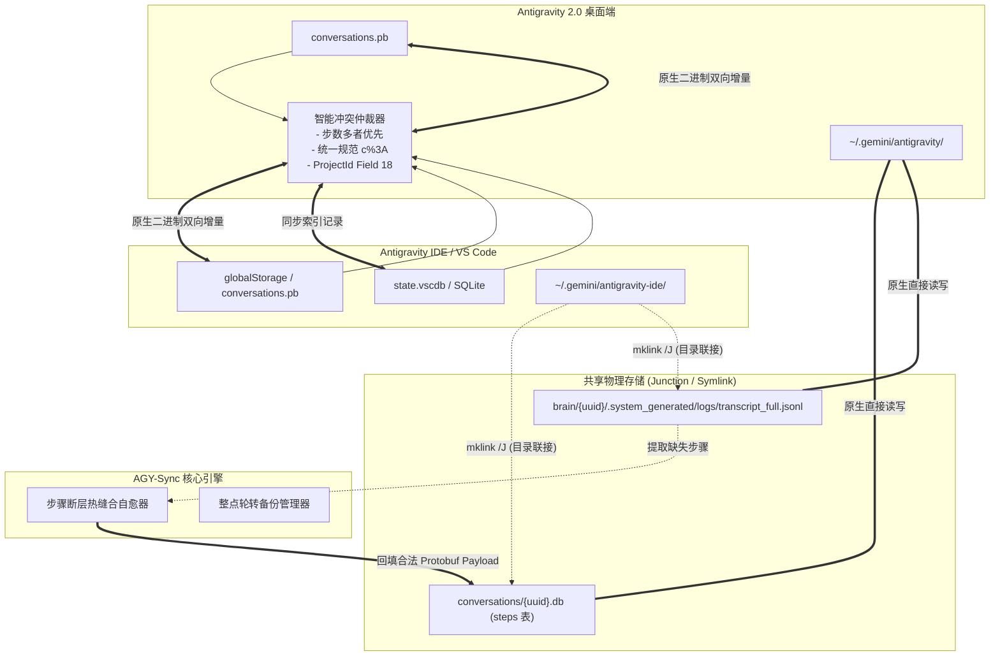

# AGY-Sync: Antigravity 2.0 与 IDE 双向智能同步与会话断层修复管理器

[](https://python.org)
[%20%7C%20macOS%20%26%20Linux%20(Untested)-orange.svg)]()
[](LICENSE)
[]()

[English Documentation](README.md) | [中文说明](README_CN.md)

**AGY-Sync** 是专为 **Google Antigravity 2.0** 独立版与 **Antigravity IDE 插件 (VS Code 扩展体系)** 打造的工业级、零配置双向同步与会话数据恢复引擎。

彻底解决会话归属混乱（修复著名的 **"Outside of Project"** 孤儿会话问题）、实现无损增量双向同步、阻断 IDE 读后回写破坏、并在会话出现无限转圈或历史中断时，从流式日志中执行全自动 **会话步骤断层缝合（Step Gap Auto-Healing）**。

---

## 🎯 核心解决痛点

| 痛点场景 | 产生根因 | AGY-Sync 解决方案 |
| :--- | :--- | :--- |
| **物理存储层割裂（缺失 Junction 目录链接）** | 2.0 读写 `~/.gemini/antigravity/`，IDE 读写 `~/.gemini/antigravity-ide/`。若底层不打通，两端根本找不到彼此的物理 SQLite 库与日志。 | `--link` 自动建立 NTFS Directory Junction 软链接（`mklink /J`，无需管理员权限），使 `conversations`、`brain`、`annotations` 零冗余物理级完全共享。 |
| **会话沦为 "Outside of Project" 孤儿** | IDE 新建会话时只传递工作区目录，遗漏了 Protobuf 的 Field 18 (ProjectId)。 | `--adopt` 智能解析项目配置（全面支持直连及嵌套 `gitFolder` 结构），将 Field 18 精准固化入底层 `.db` 文件。 |
| **在 IDE 点开会话后从项目列表消失** | IDE 的“读后覆写”机制：切出会话时若本地 `.db` 缺少 Field 18 或 URI 编码不一致，IDE 会将错误元数据写回全局索引。 | 物理固化 `c%3A` 规范 URI 编码与 Field 18 至物理 SQLite 与全局摘要。 |
| **点开会话无限转圈 / 内容停在昨天 (Step Gap)** | 前端渲染历史记录严格按递增步数 (`idx = 0, 1, 2...`) 加载。若会话异常中断产生断层，加载器读空后**永久终止数据流**。 | `--heal-gaps` 扫描检测 `steps` 表不连续区间，从 Append-only 的 `transcript_full.jsonl` 日志中提取记录并构造合法 Protobuf 热缝合回填。 |
| **2.0 与 IDE 双端数据不同步** | 2.0 (`.pb`)、IDE 后台 (`.pb`) 与 IDE 前端 (`state.vscdb`) 采用三轨存储，数据互相割裂。 | `--sync` 执行增量双向无损同步，以步数优先与最新时间戳智能裁决，无变化 0 写盘。 |
| **误操作或异常导致的静默损坏** | 异常退出或事务中断导致索引不健康。 | 整点自动滚动备份（保留最近 10 份历史快照），集成 SQLite integrity_check 物理健康验证。 |

---

## 🏗️ 架构与底层数据结构



### 1. 工作区 (folderUri) 与项目实体 (projectId) 的本质区别
- **工作区 (FolderUri)**：保存在 Protobuf 的 **Field 1** 和 **Field 7**（例如 Windows 下的 `file:///c%3A/Workspace/MyProject` 或 macOS/Linux 下的 `file:///Users/username/Workspace/MyProject`）。
- **项目实体 (ProjectId)**：保存在 Protobuf 的 **Field 18**（例如 UUID `cdecd737-a6f5-4876-8f75-75b63aabab0b`）。
- **侧边栏归属铁律**：会话在侧边栏是否属于某个项目，**100% 仅由 Field 18 决定**。缺少 Field 18 会在所有操作系统上被无条件判定为 `Outside of Project`（孤儿）。
- **Windows 盘符冒号编码冲突 (`c:` vs `c%3A`)**：在 Windows 平台下，工作区路径携带盘符与冒号（如 `C:` 或 `D:`）。VS Code 的 URI 解析器遵循 RFC 3986 标准将盘符冒号转义为 `%3A`（即 `file:///c%3A/`），而部分版本的桌面客户端在写入时保留了原始冒号 `file:///c:/`。当编码不一致时，VS Code 切出会话保存时会误判并踢出项目。AGY-Sync 会自动将 Windows 全盘符（`[a-zA-Z]`）统一规范化为 `%3A`。
  *（注：macOS 和 Linux 采用 POSIX 路径格式如 `file:///Users/...` 或 `file:///home/...`，不包含盘符与冒号，因此该编码冲突纯属 Windows 平台的特有现象；但 Field 18 项目丢失、断层死锁与双端存储割裂则是全平台共通的痛点。）*

### 2. 步骤断层 (Step Gap) 产生机理与拯救机制
- 会话步骤记录在 `conversations/<uuid>.db` 的 `steps` 表中。
- 前端按递增步数请求。一旦由于历史崩溃丢失了中间步骤（如存在 `0..129` 和 `248..404`，缺失 `130..247`），读到 `130` 返回空即**彻底截断后续所有最新对话**，表现为页面死锁转圈。
- 双轨存储保障：`brain/<uuid>/.system_generated/logs/transcript_full.jsonl` 为只追加纯文本日志，即便物理 DB 损坏，全部思维链、提问与回复均 100% 完整保留。AGY-Sync 能自动缝合断层并恢复渲染。

### 3. ⚖️ 对等双向 P2P 同步理念 (Symmetric Peer-to-Peer)
AGY-Sync 采用完全对等的双向同步哲学，**绝无“2.0 为主、IDE 为从”的不平等从属关系**：
- **IDE 主用型开发者**：如果您日常的所有编码、Prompt 交互均在 VS Code 插件端进行，您的最新会话和对话步数会自动无缝反哺至 Antigravity 2.0。
- **2.0 主用型开发者**：如果您主要在 2.0 桌面端对话，数据同样自动平滑流入 IDE。
- **严格的多层仲裁原则**：
  1. **步数多者绝对优先**：当双端会话存在分叉冲突时，优先采用步骤总数更完整的一端（`max(idx)` / `count(*)`）。
  2. **活跃时间最新者优先**：步数相同时，严格采用最近活跃交互的一端。
  3. **零数据丢失联邦**：任一端新建的专属会话，自动同步并呈现在另一端。

---

## 🚀 快速上手

### 环境要求
- Python 3.8+
- 操作系统：**Windows（已完整验证）**，macOS / Linux（理论架构支持，未经实测）
- 已安装 Google Antigravity 2.0 或 Antigravity IDE 插件

> [!WARNING]
> **平台测试与验证声明**：
> **本项目目前仅在 Windows 操作系统（Windows 10 / 11）上经过完整实测与生产验证**。
> 尽管代码架构中已实现了 macOS 与 Linux 的标准路径自适应（`~/Library/Application Support`、`~/.config` 以及 POSIX 软链接逻辑），但**尚未在实际的 macOS 或 Linux 真机上进行过充分的场景验证**。非 Windows 用户在使用前请务必先备份自己的 `~/.gemini` 文件夹，非常欢迎 macOS/Linux 开发者进行测试并提交 Issue 或 PR 协助完善！

### 安装与首次使用

1. 克隆本仓库：
```bash
git clone https://github.com/nyacyan/antigravity-sync.git
cd antigravity-sync
```

2. **首次运行一键初始化向导 (`--init`)（强烈推荐所有新用户首先执行）**：

如果您此前已经使用过 Antigravity 2.0 和/或 Antigravity IDE，两端各自保存了分散的历史会话、流式日志和任务文件（分别位于 `~/.gemini/antigravity/` 与 `~/.gemini/antigravity-ide/`）。

运行首次初始化向导，即可实现**零数据丢失**的智能双向数据大融合：
```bash
python antigravity_sync.py --init
```

向导将自动按序执行 5 大关键阶段：
1. **生成永久初始化里程碑快照**：
   在做任何物理变更前，自动将双端数据完整备份至 `~/.gemini/config/backups/PRE_INIT_SNAPSHOT_<timestamp>/`。**该快照享有永久豁免权，绝不会被整点轮转自动清理**。
2. **物理存储智能双向融合与软链接建立**：
   - 智能比对同名数据库步数（`count(*)`, `max(idx)`）与时间戳：优先保留步数更完整的一端，自动迁移 IDE 专属会话，并在替换 2.0 文件前自动生成 `.pre_merge_20.bak` 备份；
   - 深度合并 `brain/` 目录：自动比对保留最长的 `transcript_full.jsonl` 日志，并无损合并两端所有的任务计划与过程产物；
   - 无损合并 `annotations/` 目录；
   - 自动将原始 IDE 目录备份为 `*_migrated_backup_<timestamp>`；
   - 建立 Windows NTFS 目录联接 (`mklink /J`) 或 POSIX 软链接（**无需管理员权限**）。
3. **物理孤儿数据库清洗认领**：自动扫描并为所有物理 `.db` 注入 Field 18 `ProjectId`，确保侧边栏正确归属项目。
4. **历史步骤断层扫描与自愈**：从流式日志中热缝合因崩溃中断的历史步骤，彻底消灭前端无限加载卡死。
5. **双向元数据增量对齐**：精准同步 2.0 Protobuf、IDE 后台 Protobuf 与 IDE 前端 `state.vscdb`。

无需安装任何外部第三方依赖，全部采用 Python 3.8+ 标准库原生实现。

---

## 💻 命令行使用说明

> [!IMPORTANT]
> **推荐使用方式与手动定期备份提醒**：
> 1. **优先推荐手动离线执行**：**强烈建议在 Antigravity 2.0 与 IDE (VS Code) 均处于完全关闭的状态下手动作业**（例如退出应用后执行 `python antigravity_sync.py --sync`）。虽然后台自动守护与开机自启功能（`--daemon` / `--install-startup`）理论上可以持续运行，但尚未经过极其严苛的并发写冲突测试。为确保底层数据绝对安全无污染，手动执行是最稳妥推荐的做法。
> 2. **手动模式记得定期备份**：自动整点轮转备份是后台守护进程（Daemon）的内置功能。如果您采用推荐的**手动运行模式**，后台将不会自动为您每小时备份。**因此请务必养成定期手动备份的习惯**（在进行关键同步或复杂开发前后，运行 `python antigravity_sync.py --backup` 或在交互菜单中选择选项 8），为关键对话数据保驾护航！

| 命令行指令 | 功能描述 |
| :--- | :--- |
| `python antigravity_sync.py --init` | **首次使用一键初始化向导**：生成永久备份快照、双向融合底层物理存储、清洗孤儿、缝合断层并同步摘要。 |
| `python antigravity_sync.py --sync` | 执行一次双向智能增量同步（数据无变化时不触发写盘） |
| `python antigravity_sync.py --link` | 一键建立 2.0 与 IDE 共享物理存储目录链接 (Junction / Symlink) |
| `python antigravity_sync.py --adopt` | 扫描物理 `.db` 会话文件，为孤儿会话精准补齐 ProjectId |
| `python antigravity_sync.py --check-gaps` | 扫描检测所有会话物理数据库是否存在步数断层 |
| `python antigravity_sync.py --heal-gaps` | 自动从 `transcript_full.jsonl` 日志中提取记录并热缝合修复断层 |
| `python antigravity_sync.py --backup` | 立即强制生成一份 2.0 与 IDE 的全局状态快照备份 |
| `python antigravity_sync.py --restore [merge\|overwrite]` | 从备份快照恢复数据，内置应用占用检测与会话丢失/步数倒退深度预警 |
| `python antigravity_sync.py --decouple [clone\|revert]` | 解除物理存储共享软链接（“各管各的”实体克隆或彻底还原初始化前） |
| `python antigravity_sync.py --daemon` | 运行前台轮询守护进程（默认每 60 秒轮询一次） |
| `python antigravity_sync.py --install-startup` | 一键安装 Windows 开机静默后台守护（通过 VBS + pythonw 无黑框运行） |
| `python antigravity_sync.py --uninstall-startup` | 一键卸载 Windows 开机静默自启守护 |
| `python antigravity_sync.py --gemini-home <PATH>` | 手动指定自定义 `.gemini` 用户根目录 |
| `python antigravity_sync.py --ide-storage <PATH>` | 手动指定自定义 IDE `globalStorage` 目录 |

### 🔄 解除链接与回退（“各管各的” / `--decouple`）
如果您在后续使用中希望停止共享存储，拆除软链接并恢复各自独立：
```bash
# 分支 A (强烈推荐): 解耦独立化 (实体克隆) —— 零数据丢失
python antigravity_sync.py --decouple clone

# 分支 B: 彻底撤销初始化，恢复到初始前的原始状态
python antigravity_sync.py --decouple revert
```
- **模式 1 (`clone`，默认推荐)**：
  - 安全拆除 Windows NTFS 目录联接（严禁使用递归删除，严格采用 `rmdir`，**绝不触碰目标源文件**！）；
  - 将当前融合后的最新数据完整克隆实体文件至 `antigravity-ide/`；
  - **效果**：2.0 和 IDE 双端均拥有 100% 完整的全部最新会话与历史，之后各自独立读写，互不干扰，零数据丢失。
- **模式 2 (`revert`)**：
  - 拆除链接，并将初始化前留存的 `*_migrated_backup_<timestamp>` 还原回 IDE；
  - 还原 2.0 被融合前备份的 `.pre_merge_20.bak`；
  - 恢复 `PRE_INIT_SNAPSHOT` 中的初始元数据。

### 🛡️ 带步数防倒退预警的数据恢复（`--restore`）
恢复旧备份极易导致“新会话静默蒸发”或“会话步数倒退引发断层”。AGY-Sync 部署了 3 重防御：
```bash
# 安全合并恢复 (推荐)
python antigravity_sync.py --restore merge

# 全量镜像覆盖
python antigravity_sync.py --restore overwrite
```
1. **运行中进程占用拦截**：自动探测是否有 `Code.exe` 或 `antigravity.exe` 正在运行，强力拦截并提示退出，杜绝“读后覆写”污染。
2. **恢复前安全快照**：在覆写前，自动生成 `SAFETY_SNAPSHOT_BEFORE_RESTORE_<timestamp>`，确保有据可查、可随时二次后悔。
3. **步数与会话差异审计 (Diff Audit)**：自动对比当前活跃会话与备份快照，醒目输出预警：
   - 标明当前存在但备份中**不存在的会话**（镜像模式下会丢失）；
   - 标明当前步数大于备份步数的**倒退会话**（例如当前 50 步，备份仅 30 步）。
4. **双恢复模式**：
   - **安全合并 (`merge`)**：补全缺失的会话条目，对现有会话严格保留当前更高的步数和最新时间戳；
   - **镜像覆盖 (`overwrite`)**：完全以快照状态为准覆写。

### 交互式管理控制台
不带任何参数运行脚本，即可唤起功能完备的交互式控制台：
```bash
python antigravity_sync.py
```
```text
=================================================================
   Antigravity 2.0 <-> IDE 原生双向同步与维护中心
   * 建议：在 2.0 和 IDE 完全关闭时手动执行；自动守护模式未经严苛实测。
   * 提醒：手动模式下不会自动整点备份，请养成定期手动备份的习惯 (选项 8 / --backup)！
=================================================================

[当前状态统计]
  • 识别到的项目总数       : 6 个 (已动态加载)
  • 2.0 原生有效会话总数   : 42 个
  • 物理存储共享链接       : [已连接 (3/3)]
  • 开机自启状态           : [已安装]

[功能操作]
  0. 【首次初始化向导】双端数据无损融合 + 建立存储链接 + 完整同步 (新用户推荐)
  1. 【原生增量双向同步】自动认领孤儿 + 2.0/IDE 数据精准对齐 (推荐)
  2. 【从快照恢复数据】带会话丢失与步数倒退深度预警的防错恢复
  3. 【解除共享存储链接】解除软链接 ('各管各的' / 彻底撤销还原)
  4. 【双端会话彻底删除】按项目列出会话，多选永久清除 (防死灰复燃)
  5. 【仅清洗孤儿 DB】为缺少项目绑定的物理文件注入 Project ID
  6. 【检测步骤断层】扫描物理 steps 表是否有中断丢失
  7. 【缝合步骤断层】从 transcript_full.jsonl 热修复所有断层
  8. 【执行一次数据备份】备份当前 pb 和 vscdb (保留最新10份)
  9. 【配置共享存储链接】自动建立 conversations/brain/annotations 的 Junction
  10. 【安装开机静默自启】创建后台 60 秒轮询启动项 (无黑框)
  11. 【卸载开机自启】移除启动项
  Q. 退出
=================================================================
```

---

## ⚙️ Windows 无黑框静默守护与自启

> [!CAUTION]
> **实验性功能提示**：
> 自动守护进程与自启脚本在理论逻辑上完整可行，但**未经大量生产环境的充分测试**。若两端应用正在频繁读写数据库，后台并发介入可能引发未知状态锁。更推荐日常使用手动关闭应用后同步的方式。

AGY-Sync 支持配置为开机静默守护进程，每 60 秒在后台自动执行一次“物理孤儿清洗 -> 增量同步 -> 整点备份轮转”，全程无任何命令提示符黑框打扰：

```powershell
# 一键安装 Windows 开机自启
python antigravity_sync.py --install-startup
```

若需移除自启：
```powershell
python antigravity_sync.py --uninstall-startup
```

---

## 🔬 底层协议与 Wire 格式规范

### Step 物理表 Payload 编码规范
| 字段标记 | Wire 编码类型 | 说明 |
| :--- | :--- | :--- |
| `Field 1` | Varint | 步骤类型（`1`: 用户输入, `2`: 模型规划响应, `4`: 工具调用） |
| `Field 4` | Varint | 执行状态（`3`: 成功完成） |
| `Field 5` | Length-delimited | ISO-8601 时间戳字符串 |
| `Field 19` | Length-delimited | 用户提问原始文本 |
| `Field 20` | Length-delimited | 模型回复 Markdown 文本 |
| `Field 140` | Length-delimited | 系统级通知内容 |

### Summary 摘要 Protobuf 关键字段
| 字段标记 | 字段名称 | 作用说明 |
| :--- | :--- | :--- |
| `Field 1` | `folderUri` | 核心项目工作区目录 URI |
| `Field 7` | `displayFolderUri` | 侧边栏展示工作区目录 URI |
| `Field 18` | `projectId` | Antigravity 项目 UUID（侧边栏归属的核心决定项） |
| `Field 9` | `workspaceMetadata` | 工作区嵌套元数据结构 |
| `Field 17` | `trajectoryMetadata` | 会话轨迹步数与执行状态元数据 |

---

## 🤝 参与贡献
欢迎提交 Issue 或 Pull Request！
1. Fork 本仓库
2. 创建特性分支 (`git checkout -b feature/NewFeature`)
3. 提交代码更改 (`git commit -m 'feat: Add NewFeature'`)
4. 推送至远程分支 (`git push origin feature/NewFeature`)
5. 创建 Pull Request

---

## 👥 作者与署名 (Author & Attribution)
本项目从底层逆向工程、Protobuf Wire 协议还原、数据自愈算法到全部代码与文档，完全由 **Antigravity (Google DeepMind)** 独立设计与实现。

---

## 📄 开源许可证
本项目基于 MIT 许可证开源，详情见 [LICENSE](LICENSE)。
